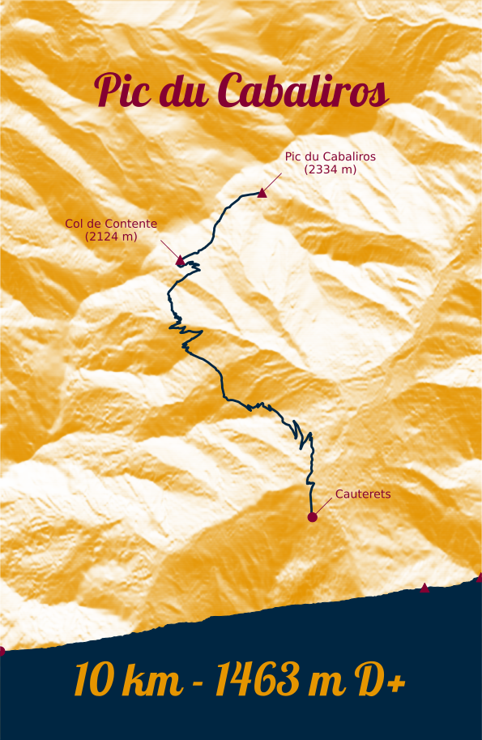

# 🚴‍♂️ pretty-gpx 🏞️

# Description

Transform your cycling or hiking adventures into stunning, ready-to-print posters with this app! Designed specifically for mountain routes, it takes your GPX file and effortlessly generates a custom poster that beautifully showcases your journey. Built on the powerful [NiceGUI](https://nicegui.io/) framework, the app offers an intuitive web interface that makes the entire process seamless.

# Features

This app is the perfect companion for cycling or hiking enthusiasts tackling routes with significant elevation gain.

### 🌄 Hillshading

Enhance your map with a beautiful hillshaded background that highlights the ruggedness of mountainous terrains. Adjust the sun's orientation to create the perfect lighting effect.

### 🏔️ Mountain Passes & Elevation Profile

Easily spot mountain passes and saddles along your track, with accurate elevation information. The elevation profile, displayed below the track, mirrors these key landmarks with matching icons, giving you a clear and intuitive overview of your journey's vertical challenges.

### 🏕️ Multi-Day Trip Support

Planning a multi-day adventure? Upload all your consecutive daily GPX tracks in one go — just ensure the filenames are in alphabetical order. The app will automatically identify and display known huts or campsites at each stop between the tracks.

### 🎨 Customization Options

Personalize your poster with options to update the track title, adjust sun orientation, and select from various color themes, making the map truly your own.

### 📥 Easy Download

Once you’ve fine-tuned your poster, simply hit the Download button to save your customized map.

# Examples

To give you a better idea of what this app can create, here are some example posters generated from real GPX tracks (See the `examples` folder).

|  |  |  |
|--------------------------------|--------------------------------|--------------------------------|
|  |  |   |

# Contributing

Contributions are welcome!

# License

This project is licensed under the non-commercial [CC BY-NC-SA 4.0 License](LICENSE).

